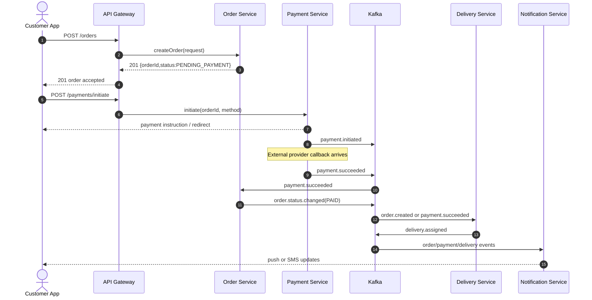

# Communication Patterns

## Synchronous vs Asynchronous

- Use REST for request-response interactions that must complete immediately for UX continuity.
- Use Kafka events for state propagation, retries, fanout, and analytics ingestion.
- Make every externally visible write endpoint idempotent with `Idempotency-Key`.

## REST Interaction Patterns

| Pattern | Example |
|---|---|
| Query composition | Meal Builder fetches item/components from Menu Service |
| Command with immediate acknowledgment | Order Service creates order, returns `PENDING_PAYMENT` |
| Provider callback | Payment Service receives EcoCash/OneMoney webhook |
| Read model lookup | API Gateway requests user profile summary |

## Kafka Topic Catalog

| Topic | Key | Producer | Consumers | Retention |
|---|---|---|---|---|
| `auth.user.registered` | `user_id` | Auth | User, Notification, Analytics | 7 days |
| `menu.item.updated` | `item_id` | Menu | Meal Builder, Analytics | 3 days |
| `menu.inventory.changed` | `vendor_id:item_id` | Menu | Order, Meal Builder, Analytics | 3 days |
| `order.created` | `order_id` | Order | Payment, Delivery, Notification, Analytics | 7 days |
| `order.status.changed` | `order_id` | Order | Notification, Analytics | 7 days |
| `payment.initiated` | `payment_id` | Payment | Analytics | 7 days |
| `payment.succeeded` | `order_id` | Payment | Order, Delivery, Notification, Analytics | 7 days |
| `payment.failed` | `order_id` | Payment | Order, Notification, Analytics | 7 days |
| `delivery.assigned` | `order_id` | Delivery | Order, Notification, Analytics | 7 days |
| `delivery.location.updated` | `delivery_id` | Delivery | Order, Notification | 24 hours |
| `delivery.completed` | `order_id` | Delivery | Order, Notification, Analytics | 7 days |
| `notification.sent` | `notification_id` | Notification | Analytics | 3 days |

## Sequence: Place Order and Pay

## Reliability Rules

- Producers use at-least-once delivery with idempotent consumers.
- Consumer offsets commit only after transactional state writes succeed.
- Dead letter topics are configured for callback parsing errors.
- Retry backoff: 1s, 5s, 30s, then DLQ.
