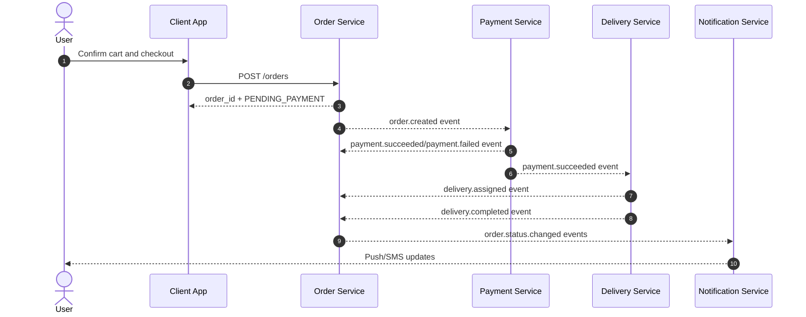
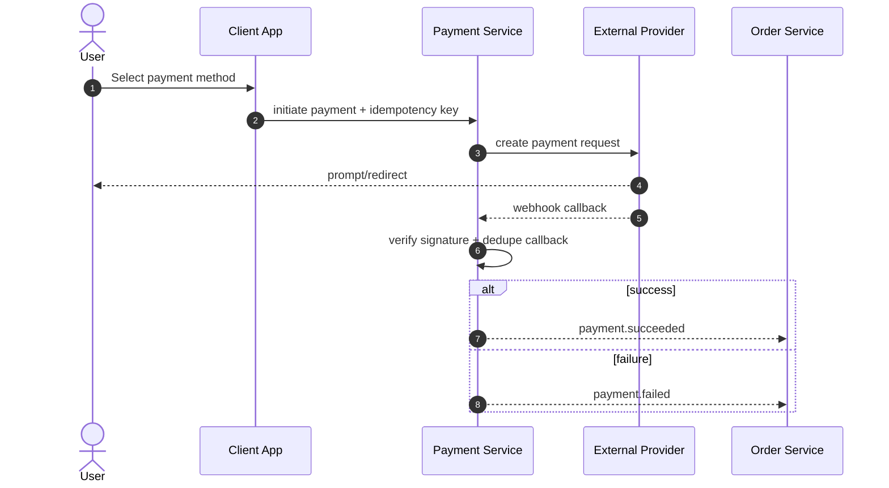
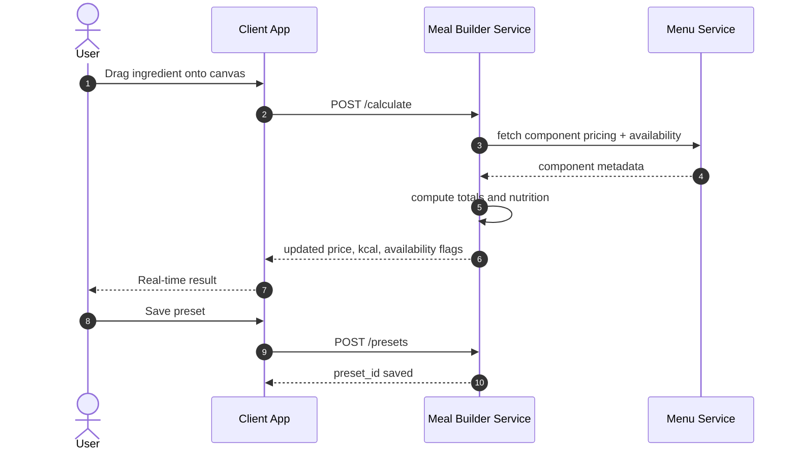

# Data Flow

## Order Lifecycle

## Payment Flow (EcoCash / OneMoney / Card)

## Meal Builder Flow

## Data Ownership Constraints

- Only Order Service writes `orders` and `order_status_history`.
- Only Payment Service writes `payments` and payment callbacks.
- Only Delivery Service writes `deliveries` and tracking points.
- Cross-domain updates happen through events, not direct table writes.
