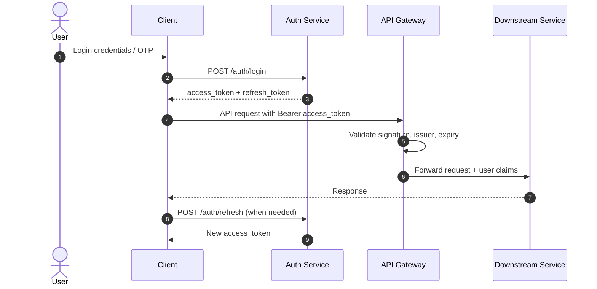

# Security Architecture

## Authentication Flow

## RBAC Matrix

| Capability | CUSTOMER | VENDOR_ADMIN | VENDOR_STAFF | RIDER | SYSTEM_ADMIN |
|---|---|---|---|---|---|
| Manage own profile | Yes | Yes | Yes | Yes | Yes |
| Manage vendor profile | No | Yes | No | No | Yes |
| Manage menu + inventory | No | Yes | Yes (scoped) | No | Yes |
| View vendor analytics | No | Yes | Yes (read-only) | No | Yes |
| Place/cancel own order | Yes | No | No | No | Yes |
| Manage delivery states | No | No | No | Yes (assigned only) | Yes |
| Refund payments | No | No | No | No | Yes |
| Platform configuration | No | No | No | No | Yes |

## API Security Controls

- TLS 1.2+ everywhere; HSTS enabled at edge.
- JWT access token TTL: 15 minutes.
- Refresh token TTL: 30 days with rotation.
- `Idempotency-Key` required on payment initiation and order creation endpoints.
- Input validation with bean validation + schema checks.

## Encryption and Secrets

| Asset | Control |
|---|---|
| Passwords | Argon2id hashing with per-user salt |
| Tokens at rest | Encrypted in PostgreSQL using KMS-managed keys |
| Provider credentials | Kubernetes Secrets backed by sealed secrets workflow |
| PII exports | Encrypted object storage + short-lived signed URLs |

## Rate Limiting

| Surface | Strategy | Limit |
|---|---|---|
| Login endpoint | Token bucket per IP + phone/email | 5 req/min |
| OTP verify | Sliding window per principal | 10 req/10 min |
| Order create | Sliding window per user | 20 req/hour |
| Public vendor search | Per IP | 120 req/min |
| Payment initiate | Per user and device fingerprint | 10 req/hour |

## Audit and Compliance

- Immutable audit log for auth, payment, refund, and admin actions.
- PII access is logged with actor, reason, and request trace id.
- Payment callback payloads retained for reconciliation and dispute handling.
