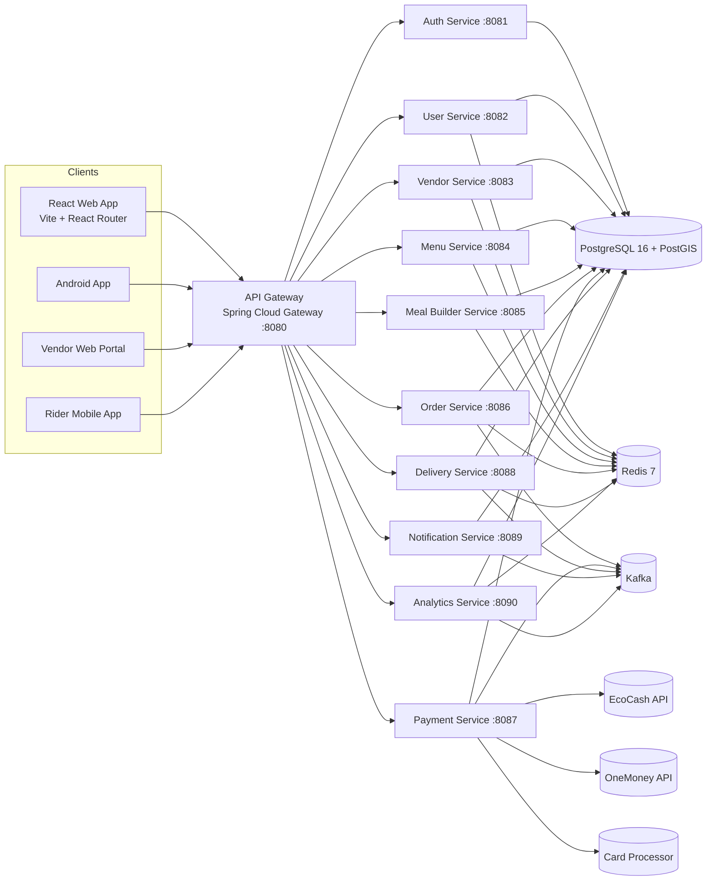

# System Overview

ZimBite is a production-grade breakfast delivery platform for Zimbabwe optimized for 5AM-10AM peak demand and unstable mobile network conditions.

## Architecture Goals

- Deliver hot breakfast within strict morning SLA windows.
- Support meal customization with drag-and-drop composition.
- Keep vendor and rider operations real-time and fault tolerant.
- Minimize payload size and round-trips for low-bandwidth users.
- Isolate failures with service boundaries and async events.

## C4 Container View (Mermaid)

## Service Interaction Matrix

| Caller | Callee | Mode | Purpose |
|---|---|---|---|
| API Gateway | All services | REST | Routing, auth propagation, rate limiting |
| Meal Builder | Menu Service | REST | Ingredient availability and pricing lookup |
| Order Service | Payment Service | REST + Kafka | Payment intent, status updates |
| Order Service | Delivery Service | Kafka | Trigger rider assignment |
| Payment Service | Order Service | Kafka | Payment success/failure events |
| Delivery Service | Order Service | Kafka | Pickup and drop-off status events |
| Notification Service | User/Order/Payment topics | Kafka | User notifications and message fanout |
| Analytics Service | Domain topics | Kafka | Near real-time dashboards and KPIs |

## Core Tech Decisions

| Decision | Choice | Why |
|---|---|---|
| Service architecture | Microservices | Independent scaling for order, payment, and delivery peaks |
| Data store | PostgreSQL + PostGIS | Relational integrity plus geospatial search |
| Cache | Redis | Hot menu/user/session data and rate limiting counters |
| Event bus | Kafka | High-throughput ordered streams and replay capability |
| Frontend | React + Vite | Fast startup and simple deployment footprint |
| Auth | JWT + OAuth2 | Stateless API auth with short-lived access tokens |
| Deployment | Kubernetes | Horizontal scaling and resilient rollout patterns |

## Non-Functional Targets

| Metric | Target |
|---|---|
| Menu browse payload | < 500KB first load |
| P95 API latency (read) | < 350ms |
| P95 order placement | < 1200ms excluding external payment callback |
| Platform availability | 99.9% monthly |
| Recovery objective (RTO) | <= 30 minutes |
