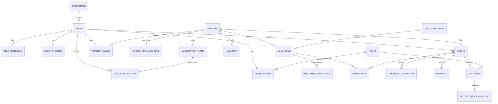

# ER Diagram

The schema is logically separated by service ownership while running in one PostgreSQL instance.

## Mermaid ER

## Data Ownership

| Schema | Owning Service | Primary Tables |
|---|---|---|
| `auth` | Auth Service | `refresh_tokens` |
| `user_mgmt` | User Service | `users`, `corporates`, `user_addresses`, `user_favorites` |
| `vendor_mgmt` | Vendor Service | `vendors`, `vendor_operating_days` |
| `menu_mgmt` | Menu Service | `menu_categories`, `menu_items`, `menu_item_components`, `saved_meal_presets`, `inventory` |
| `ordering` | Order Service | `orders`, `order_items`, `order_status_history` |
| `payment_mgmt` | Payment Service | `payments`, `payment_callbacks`, `payment_methods_saved` |
| `delivery_mgmt` | Delivery Service | `riders`, `deliveries`, `delivery_tracking_points` |
| `subscription_mgmt` | Subscription Service | `subscription_plans`, `user_subscriptions` |
| `feedback_mgmt` | Review Service | `vendor_reviews`, `rider_reviews` |

## Design Notes

- UUID primary keys are used across all tables.
- `orders.customization_json` stores flexible meal builder snapshots.
- `order_items` stores denormalized names/prices for historical integrity.
- Payment idempotency is enforced in `payment_mgmt.payments`.
- Geospatial fields (`geometry(Point,4326)`) support vendor and rider proximity queries.
