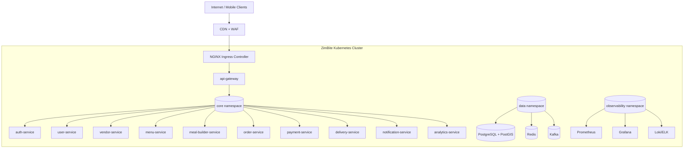

# Infrastructure Overview

## Cluster Topology

## Namespaces

| Namespace | Purpose |
|---|---|
| `zimbite-core` | Application workloads and gateway |
| `zimbite-data` | Stateful data services (or external managed endpoints) |
| `zimbite-observability` | Metrics, logs, tracing stack |
| `zimbite-jobs` | Scheduled jobs and backfill tasks |
